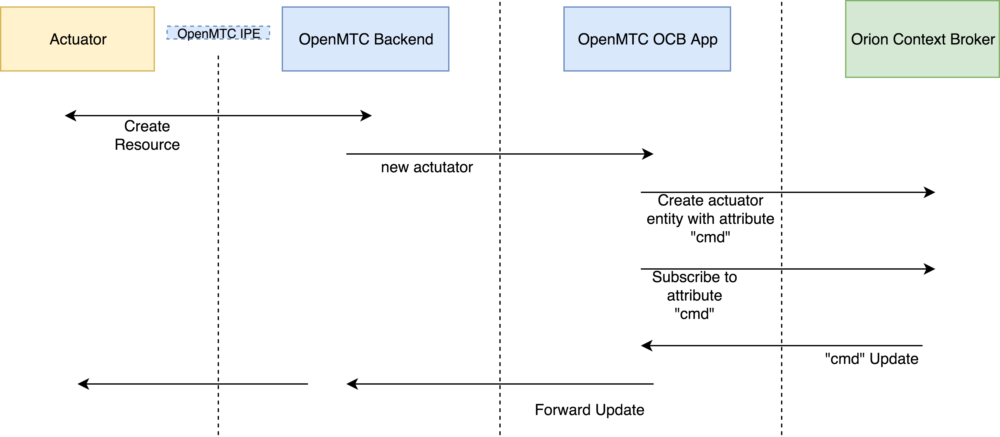

# Introduction

OrionContextBroker (OCB) is an OpenMTC AE to forward OpenMTC sensor data (via Subscription) to an instance of the Orion Context Broker. Additionally OpenMTC actuators are handled by forwarding changes on the OCB side via OpenMTC to the actuator.
All Content Instances are expected to use the SenML format. It is possible to connect the AE either to an OpenMTC Gateway or an OpenMTC Backend.

# Getting started

Within the OpenMTC root directory the app can be started via

```
./apps/orion-context-broker -v
```

## Configuration

It is possible to configure the AE either via config.json or CLI parameters. All possible parameters can be shown via:

```
./apps/orion-context-broker  -h
```

The most important parameters are:

* ep (the OpenMTC host)
* labels (the labels that should be forwarded to the OrionCB, one label has to match (OR), empty ([""]) means every label)
* interval (for periodic discovery)
* orion_host (hostname:port of the Orion CB)
* accumulate_address (Subscription Sink (RESTful HTTP) used for subscriptions to the OCB (actuator functionality))

## Example Setup with Docker


The illustration above shows an example setup, which can be created using docker-compose with the docker-compose.yml file listed at the end of this section.
For this example an OpenMTC Interworking Proxy called CUL868IPE is used in simulation mode, in order to periodically generate sensor data without the need of real physical sensors. This IPE will exchange data with an OpenMTC Gateway. The Gateway itself is connected to an OpenMTC Backend. The OpenMTC OCB-App will on one hand forward sensor data to the OrionContextBroker and on the other hand will forward actuator events to the simulated actuator on the CUL868IPE.

The following docker-compose.yml shows the necessary configuration:

```
version: "2"

services:
    gateway:
        image: openmtc/gateway-amd64
        ports:
            - "8000:8000"
        environment:
            - ONEM2M_NOTIFICATION_DISABLED=false
            - ONEM2M_CSE_ID=TESTUSER~TESTTENANT
            - ONEM2M_REGISTRATION_DISABLED=false
            - ONEM2M_REMOTE_CSE_POA=http://backend:18000
            - ONEM2M_REMOTE_CSE_OWN_POA=http://gateway:8000
        container_name: gateway
        links:
            - backend
        networks:
            - main

    backend:
        image: openmtc/backend-amd64
        ports:
            - "18000:18000"
        environment:
            - ONEM2M_NOTIFICATION_DISABLED=false
            - ONEM2M_HTTP_TRANSPORT_DISABLED=false
            - ONEM2M_HTTP_TRANSPORT_SSL_ENABLED=false
        container_name: backend
        networks:
            - main

    orioncontextbroker-app:
        image: openmtc/orion-context-broker-app-amd64
        container_name: orioncontextbroker-app
        links:
            - backend
        ports:
            - "8086:8086"
            - "8080:8080"
        environment:
            - EP=http://backend:18000
            - ORION_HOST=http://orion:1026
            - ORION_API=v2
            - ACCUMULATE_ADDRESS=http://orioncontextbroker-app:8080
        networks:
            - main

    culipe:
        image: openmtc/cul868-ipe-amd64
        links:
            - gateway
            - orioncontextbroker-app

        environment:
            - EP=http://gateway:8000
            - DEVICES=["fs20:16108-1"]
            - SIM=true
            - DEVICE_MAPPINGS={"S300TH_1":"kitchen","FS20_ST3_16108_1":"bath"}
        container_name: culipe
        networks:
            - main

    mongo:
        image: mongo:3.4
        command: --nojournal
        container_name: mongo
        networks:
            - main

    orion:
        image: fiware/orion
        ports:
            - "1026:1026"
        command: -dbhost mongo -logLevel debug
        container_name: orion
        networks:
            - main

networks:
  main:
    driver: bridge
```

### Tests with the Docker setup

After the setup is started, the CUL868IPE will simulate sensor data. In order to get the current temperature value measured by the sensor, it is possible to send a request either to the OpenMTC Backend, OpenMTC Gateway or the OrionContextBroker.

*OpenMTC Backend*
```
curl -X "GET" localhost:18000/~/mn-cse-1/onem2m/CUL868IPE/S300TH_1/temperature/latest -s | \
  jq -r '."m2m:cin".con' | \
  base64 -d | jq '.'
```
```json
[
  {
    "bn": "urn:dev:s300th:1",
    "v": 3.5796869716517135,
    "u": "Cel",
    "t": "1527087517.700",
    "n": "temperature"
  }
]
```

*OpenMTC Gateway*
```
curl -X "GET" localhost:8000/onem2m/CUL868IPE/S300TH_1/temperature/latest -s | \
  jq -r '."m2m:cin".con' | \
  base64 -d | jq '.'
```
```json
[
  {
    "bn": "urn:dev:s300th:1",
    "v": 3.5796869716517135,
    "u": "Cel",
    "t": "1527087517.700",
    "n": "temperature"
  }
]
```

*OrionContextBroker*

```
curl localhost:1026/v2/entities/mn-cse-1-Wohnzimmer/ -s -S | jq '."temperature"'
```
```json
{
  "type": "Float",
  "value": 20.569353172,
  "metadata": {
    "bn": {
      "type": "String",
      "value": "urn:dev:s300th:1"
    },
    "timestamp": {
      "type": "String",
      "value": "1527093220.104"
    },
    "unit": {
      "type": "String",
      "value": "Cel"
    }
  }
}
```

The following command will switch the current state of the actuator to "ON" by sending a request to the OCB:

```bash
curl localhost:1026/v2/entities/mn-cse-1-Bad/attrs -s -S \
     --header 'Content-Type: application/json' \
     -X PATCH -d @- <<EOF
{
  "cmd": {
    "value": "ON",
    "type": "String"
  }
}
EOF
```
The state will be automatically forwarded to OpenMTC. Therefore you should see something like the following in the log:
```
culipe | 172.24.0.6 - - [2018-05-26 17:24:29] "POST / HTTP/1.1" 200 160 0.037561

```
curl -X "GET" localhost:18000/~/mn-cse-1/onem2m/CUL868IPE/FS20_ST3_16108_1/switch/latest -s | jq '."m2m:cin".con'
```
```
"ON"
```
# How the data is stored at the Orion CB

The Orion CB uses the model of *entities* having *attributes*. The AE matches all Container having the label "openmtc:device" to entities. Attributes are matched to the SenML Key "n" of Content Instances. The types of values are determined by the AE to match typical Orion CB types (e.g. Int, String, Float...).

## Example

### Create Data in OpenMTC

Create an App with OpenMTC:

```
curl -X POST localhost:18000/onem2m/ -H "Content-Type: application/vnd.onem2m-res+json" -d '{"m2m:ae": {"rn": "EXAMPLE_APP_NAME", "api": "placeholder", "rr": "TRUE"}}'
```

Create an Device with OpenMTC:

```
curl -X POST localhost:18000/onem2m/EXAMPLE_APP_NAME/ -H "Content-Type: application/vnd.onem2m-res+json" -d '{"m2m:cnt": {"rn": "EXAMPLE_DEVICE_NAME", "lbl":["openmtc:device"]}}'
```

Create an Measurment (Sensor data container) with OpenMTC:

```
curl -X POST localhost:18000/onem2m/EXAMPLE_APP_NAME/EXAMPLE_DEVICE_NAME/ -H "Content-Type: application/vnd.onem2m-res+json" -d '{"m2m:cnt": {"rn": "EXAMPLE_MEASUREMENT_NAME", "lbl":["openmtc:sensor_data"]}}'
```

Upload SenML Data to OpenMTC:

```json
{
  "n": "temperature",
  "bn": "openmtc:zigbee:temp",
  "v": 24,
  "u": "Cel",
  "t": "2017-04-13 12:45:12.787239"
}
```
translated to base64: eyJuIjogInRlbXBlcmF0dXJlIiwgImJuIjogIm9wZW5tdGM6emlnYmVlOnRlbXAiLCAidiI6IDI0LCAidSI6ICJDZWwiLCAidCI6ICIyMDE3LTA0LTEzIDEyOjQ1OjEyLjc4NzIzOSJ9Cg==

```
curl -X POST localhost:18000/onem2m/EXAMPLE_APP_NAME/EXAMPLE_DEVICE_NAME/EXAMPLE_MEASUREMENT_NAME/ -H "Content-Type: application/vnd.onem2m-res+json" -d '{"m2m:cin": {"con": "eyJuIjogInRlbXBlcmF0dXJlIiwgImJuIjogIm9wZW5tdGM6emlnYmVlOnRlbXAiLCAidiI6IDI0LCAidSI6ICJDZWwiLCAidCI6ICIyMDE3LTA0LTEzIDEyOjQ1OjEyLjc4NzIzOSJ9Cg==", "cnf": "application/json:1"}}'
```

### Query Data Orion CB

```
curl localhost:1026/v2/entities/ | jq '.'
```

```json
[
  {
    "id": "EXAMPLE_DEVICE_NAME",
    "type": "openmtc",
    "temperature": {
      "type": "Int",
      "value": 24,
      "metadata": {
        "bn": {
          "type": "String",
          "value": "openmtc:zigbee:temp"
        },
        "timestamp": {
          "type": "String",
          "value": "2017-04-13 12:45:12.787239"
        },
        "unit": {
          "type": "String",
          "value": "Cel"
        }
      }
    }
  }
]
```

# Actuator Functionality



If an actuator is created in OpenMTC an event is triggered at the orion context broker app. The app will create an entity of the actuator on the OCB with an attribute "cmd". After that a subscription to the attribute "cmd" is created and therefore all change on this attribute will be forwarded to the corresponding OpenMTC backend or gateway.
